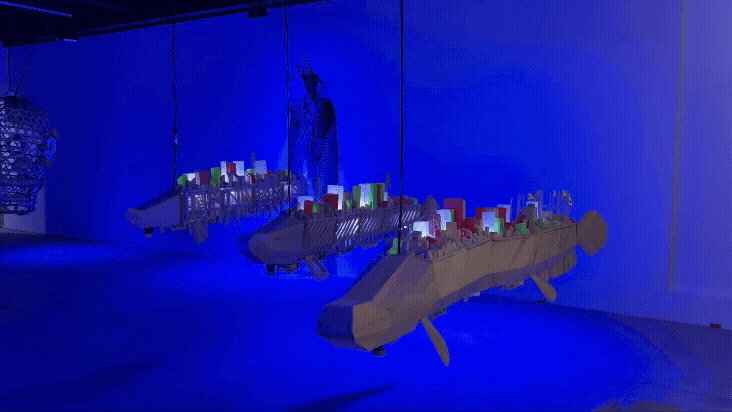

# 🌊 SWARM CITIES for Atlas Imaginario

**Art Installation Description**

This work merges traditional Miriti wood sculpture with an electromechanical system that recreates the movement of the pirarucu, a vast-bodied fish whose slow undulations embody the strength and grace. It is an allegory of the Swarm Cities, mobile archipelago-neighborhoods of Future Belém that carry people, products, and technologies. 

Miriti: An expression of the Amazonian imaginary, this ancestral material is born along riverbanks and carries the memory of those who have always been here. Its lightness and porosity evoke sustainability, artistic presence, and the defense of collective knowledge and territory. 

Electromechanical System: Reinterprets the pirarucu's movement through a choreography of tension and elasticity. Robotic motors act as muscles, pulling thread tendons and elastic bands that balance force and rest, as in living matter.

**See the show:** Fórum Landi, R. Siqueira Mendes, 60 - Cidade Velha, Belém - PA, 66020-130, Brazil

**To do Documentation:**
OSC Interface
Mechanism Details

